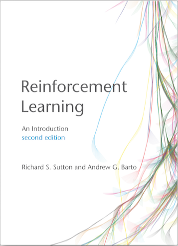

## Introduction
11111111
<!-- One classic introductory example for reinforcement learning is the "k-armed bandit problem." In this scenario, you are faced with k different slot machines (bandits), each with an unknown probability distribution of payouts. Your objective is to maximize your cumulative reward by choosing which bandit to pull at each time step.
The k-armed bandit problem is an ideal starting point for understanding reinforcement learning due to its simplicity and ability to illustrate fundamental concepts like action-value estimation, exploration-exploitation trade-off, and the role of feedback in learning optimal behaviors. Mastering this problem lays a solid foundation for tackling more complex reinforcement learning challenges such as Markov Decision Processes (MDPs) and partially observable environments. -->

## Import the notebooks into your site

The notebooks will be published to the folder you specify above. In this case, they will be published to your `content/post/` folder.
